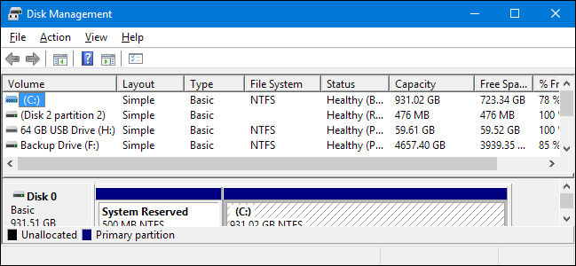
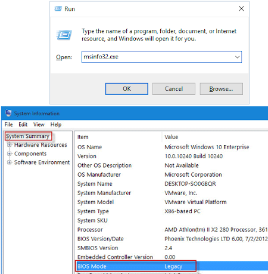

# Słowem wstępu

Polecam najpiew czytać rozdział instrukcji, próbować go wykonać samemu, w razie wątpliwości zapytać mnie.

Pamiętajcie też że D21 to budynek otwarty dla wszystkich studentów, bądźmy dla nich mili - nie zachowujmy się głośno.

# Przygotowanie komputera

## Pobierz instalator (ISO) z Ubuntu z oficjalnej strony
Oczywiście jeśli chcesz coś innego, śmiało.

## Wolna partycja

Stwórz wolną partycję na dysku, żeby zainstalować tam Linuxa. 
Klikasz prawym którąś partycję -> zmniejsz -> wpisujesz rozmiar.

**30GB** to minimalny rozmiar żeby robić cokolwiek, do poważnej pracy minimum **70GB**.  

## Wyłącz fast startup

 
Funkcja fast startup czasami nie pozwala Linuxowi grzebanie w partycjach, uniemożliwiając instalację. Po zainstalowaniu pingwina można włączyć fast startup ponownie (chociaż TBH ja nie widzę różnicy w prędkości uruchamiania).

## Sprawdź czy Twój windows działa w trybie BIOS czy UEFI

Legacy oznacza BIOS,
UEFI oznacza, kto by pomyślał, UEFI.

**To jest super ważne - zapamiętaj w jakim trybie działa Twój system.**
**Będzie od tego zależała część instalacji Linuxa.**

## Wypalanie pobranego ISO
Polecam 2 programy:

* Rufus
* Etcher
  
Są banalne w użyciu - podłącz pendrive, wybierz pobrany obraz Linuxa w programie, kliknij *Start*.

## Pod koniec tego rozdziału, musisz wiedzieć następujące rzeczy:
* Na którym dysku i jak dużą partycję zrobiłeś/łaś na linuxa
* W jakim trybie działa Twój Windows - BIOS/UEFI

# Uruchamianie z pendrive'a

**W tym rozdziale będzie trzeba zmienić parę prostych rzeczy w BIOSIE/UEFI - sprawdź model swojego laptopa i w razie potrzeby wpisuj w google hasła w stylu "ASUS Vivobook XS2137 how to change boot order" i tak dalej.**

* Wyłącz komputer

* Podłącz pendrive

* Wejdź do BIOSa/UEFI (zazwyczaj F2 albo DEL w trakcie bootowania)

* Wyłącz secure boot (sprawdź w googlach jak to się robi w twoim modelu)

* Przełącz boot device na pendrive (menu boot order -> pokaże się na dole opcja w stylu "usb device")

* **Zapisz zmiany**

* Reset

## Pod koniec tego rozdziału, musisz mieć zrobione następujące rzeczy:
* Wyłączony secure boot
* Pendrive z linuxem ustawiony jako pierwszy w menu **boot order**

# Proces instalacji

**Uważnie czytaj dialogi.**

**Jeśli Twój laptop ma GPU Nvidii to zawołaj mnie podczas uruchamiania**
## Język, klawiatura
Polecam angielski, łatwiej będzie potem nawigować po tutorialach.
Polska klawiatura jest akurat dość ważna, bo bez niej nie działają polskie znaki.

## Partycje
To jedyny trudny krok instalacji, zawołajcie mnie wtedy żebym mógł to wam zatwierdzić.

Stworzoną wcześniej na Windowsie wolną partycję należy ustawić jako:
* punkt montowania (mount point) `/`
* system plików `ext4`
* zaznaczyć tickbox *format this partition*

## JEŚLI TWÓJ SYSTEM DZIAŁA NA UEFI

Zlokalizuj partycję, która będzie podpisana jako **EFI partition**.

Kliknij w nią dwa razy i upewnij się że ma pole *use as* ustawione na *EFI system partition*.

**UPEWNIJ SIĘ ŻE *FORMAT THIS PARTITION* NIE JEST ZAZNACZONE**

Pod listą partycji znajduje się rozwijane menu *Device for bootloader installation* - ustaw na nim swoją partycję EFI.

## JEŚLI TWÓJ SYSTEM DZIAŁA NA BIOSIE
To wszystko git, nie musisz nic robić

## Pod koniec tego rozdziału, musisz mieć zrobione następujące rzeczy:

* Ustawiony język systemu i klawiatury
* Ustawione partycje na instalację Ubuntu
* Ustawioną partycję EFI (jeśli ją masz)
* Moją okejkę pod układem partycji (wołaj, serio)

# Po instalacji

## Laptopy z GPU Nvidii

Jest spora szansa że wasza karta graficzna będzie się kłóciła z domyślnymi sterownikami Linuxa, po prostu zawołajcie mnie, jeśli macie Nvidię w lapku. Zdiagnozuję.

## Praca na baterii
Do zrobienia obowiązkowo na każdym laptopie.

`sudo apt update`

`sudo apt install tlp acpi`

`sudo systemctl enable tlp`

Jak to zrobicie, wołajcie